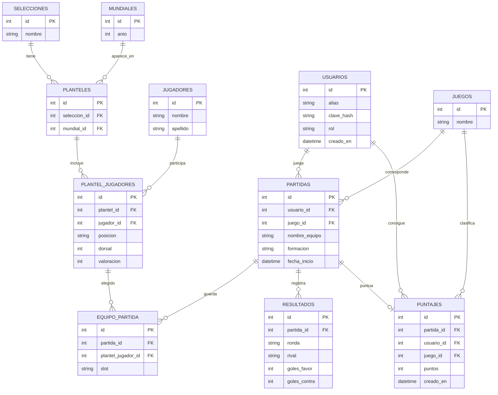

# DER - Once de Barrio conectado

```mermaid
erDiagram
    SELECCIONES ||--o{ PLANTELES : tiene
    MUNDIALES ||--o{ PLANTELES : aparece_en
    PLANTELES ||--o{ PLANTEL_JUGADORES : incluye
    JUGADORES ||--o{ PLANTEL_JUGADORES : participa
    PARTIDAS ||--o{ EQUIPO_PARTIDA : guarda
    PLANTEL_JUGADORES ||--o{ EQUIPO_PARTIDA : elegido
    PARTIDAS ||--o{ RESULTADOS : registra
    USUARIOS ||--o{ PARTIDAS : juega
    JUEGOS ||--o{ PARTIDAS : corresponde
    USUARIOS ||--o{ PUNTAJES : consigue
    JUEGOS ||--o{ PUNTAJES : clasifica
    PARTIDAS ||--o| PUNTAJES : puntua
    SELECCIONES { int id PK string nombre }
    MUNDIALES { int id PK int anio }
    PLANTELES { int id PK int seleccion_id FK int mundial_id FK }
    JUGADORES { int id PK string nombre string apellido }
    PLANTEL_JUGADORES { int id PK int plantel_id FK int jugador_id FK string posicion int dorsal int valoracion }
    USUARIOS { int id PK string alias string clave_hash string rol datetime creado_en }
    JUEGOS { int id PK string nombre }
    PARTIDAS { int id PK int usuario_id FK int juego_id FK string nombre_equipo string formacion datetime fecha_inicio }
    EQUIPO_PARTIDA { int id PK int partida_id FK int plantel_jugador_id FK string slot }
    RESULTADOS { int id PK int partida_id FK string ronda string rival int goles_favor int goles_contra }
    PUNTAJES { int id PK int partida_id FK int usuario_id FK int juego_id FK int puntos datetime creado_en }
```
